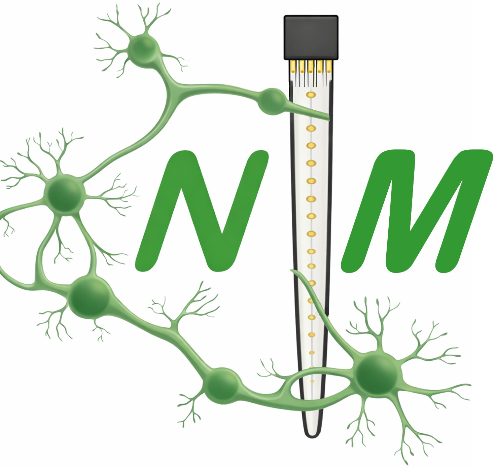

# NeuroMod - Fully Interactive Ephys Data Analysis <br> and Visualization for Matlab 




** Warning: If you want to use NeuroMod with a valid MATLAB license, it will only work with Matlab Versions 2023a or newer **

If you already have a valid Matlab license and Matlab installed, you can download all files in the native folder structure, 'cd' into the directory within Matlab and launch the NeuroMod_Toolbox_GUI.mlapp file. Then you have several options to launch the GUI:
  1. Double-click the 'NeuroMod_Toolbox_GUI.mlapp' file, which will automatically open MATLAB and the GUI.
  2. Alternatively, use the MATLAB command window to navigate (cd) to the folder where you saved the files. Then, right-click the NeuroMod_Toolbox_GUI.mlapp file in the current folder window and select "Run."
  3. Finally, you can also launch the GUI by typing the following command into the MATLAB command window after navigating (cd) to the folder containing the GUI:

```matlab
Neuromod_Toolbox_GUI
```
