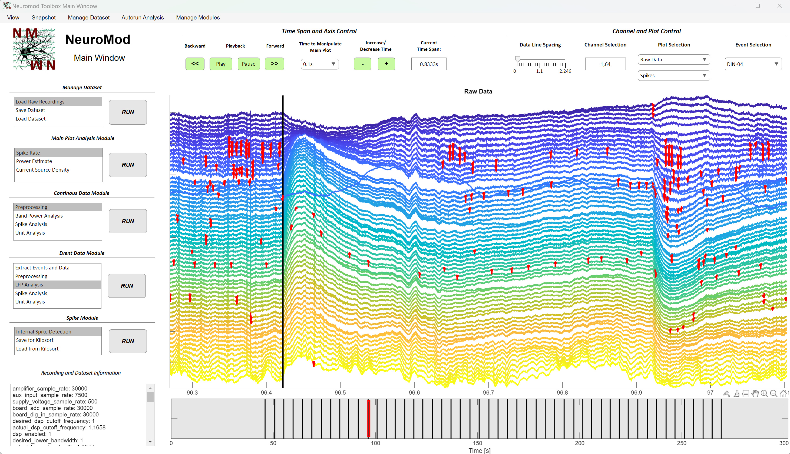
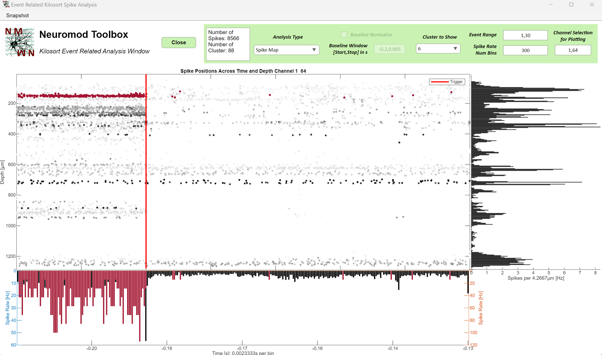
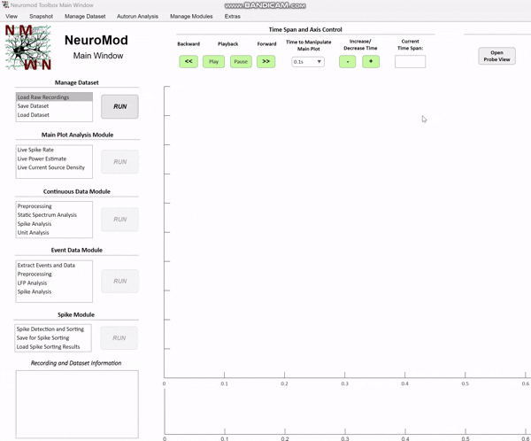

# Neuromod - Fully Interactive Ephys Data Analysis <br> and Visualization for Matlab 


** Warning: Currently only Matlab Versions 2023a or newer are supported **

Neuromod is an interactive toolbox for analyzing and visualizing electrophysiological data from single shank probe designs with arbitrary geometry. 
It seamlessly integrates established toolboxes such as Kilosort, Open Ephys Tools, Fieldtrip and SpikeInterface for a wide range of LFP and spike analyses methods, supports various data formats in a code free user interface and bridged the gap between matlab and python packages.

The aim is to offer a comfortable and user-friendly experience while providing clear instructions and feedback on actions taken, rather than hard-to-interpret error messages or opaque processes. Nearly all parameters related to data extraction and analysis are automatically set, but can still be adjusted within the GUI.
This design ensures a smooth, code-free user experience, offering helpful guidance while still having full control over the analysis.

Since the requirements for analysis and visualization can be wastly different and should be editable, the modular design philosophy of the user interface enables you to easily integrate your own analysis module into the GUI. All you have to do is to open the Matlab App Designer and copy a few lines of code from the manual, giving real time access to the whole dataset. When your app window is ready, it can be activated with a few clicks in the GUI, integrating it into the rest of the analysis ecosystem. 
Lastly an autorun functionality can be used to automatically apply all analysis and visulatzation methods available in the GUI to multiple recordings in a folder and save analysis plots and results independent of the GUI.   

As a result, Neuromod is not only ideal for teaching and evaluating recording quality before or after sessions but also for comprehensive data analysis of one or multiple recordings with your own pipeline. 

> ## **Table of Contents**
> 
- [Data Formats and Capabilities](#data-formats-and-capabilities)
  
- [How to install the GUI](#how-to-install-the-gui)
  
  - [Get Started With Example Data](#get-started-with-example-data)
  
  - [Overview of Required MATLAB Toolboxes](#overview-of-required-matlab-toolboxes)
    
  - [Overview of Other Toolboxes Used](#overview-of-other-toolboxes-used)

  - [How to Install SpikeInterface for Spike Sorting in Neuromod](#how-to-install-spikeinterface-for-spike-sorting-in-neuromod)

  - [About Performance](#about-performance)

  - [General Remarks](#general-remarks)
    
- [Rules and Philosophy of the Toolbox](#rules-and-philosophy-of-the-toolbox)
  
- [Disclaimer, License and Contact](#disclaimer-license-and-contact)

> ## **Data Formats and Capabilities**



The toolbox currently supports formats recorded with the Open Ephys GUI, Intan RHX data acquisition software (and legacy RHD software) as well as Spike2 and Cheetah software. This includes binary, .nwb and Open Ephys data formats from the Open Ephys GUI recorded with Neuropixels, Open Ephys and Intan acquisition boards; .dat and .rhd files from the Intan RHX and RHD software; .smrx files for Spike2 and .ncs for Neuralynx Cheetah files.

Besides the continous data stream, event data from all recording formats mentioned (e.g., TTL signals to the recording system) can be loaded and analyzed, enabling not only the preprocessing, analysis, and visualization of continuous data but also event-related data.
Available types of analysis include current source density analysis, static power spectrum analysis, time-frequency power analysis, and event-related potentials for low-frequency signal components as well as event related spike analysis.

Since the supported recording systems are used with a wide range of probes designs, a fully interactive probe design and probe view window enables to set arbitrary probe designs while always having an overview and full control over which channel are used for the analysis. Even Neuropixel probe designs with hundreds of recording channels almost freely distributed over the whole shank can be analysed without loosing oversight.



Lastly, the toolbox fully supports Kilosort, Mountainsort 5 and SpykingCircus 2 spike sorting. This includes saving the dataset and probe desgin for external use in one of the sorting packages with your own code/the respective GUI provided with it, as well as automatic spike sorting using SpikeInterface in the Matlab GUI. You just have to install the respective python packages (see below for instructions) and everything else is taken care of for you in the NeuroMod Matlab GUI, while still having full control over sorting parameters. In any case, spike sorting results from these sorters can be loaded for further analysis (see below for details). If these sorters cant be used, the toolbox also offers spike detection using different thresholding methods as well as spike clustering using Wave_clus 3 (which does not has to be installed). Since every analysis is shown and editable in a seperate window, spike and LFP analysis results can be easily compared and correlated. 

**NOTE:** Loading sorting results is supported for Kilosort versions 3 and 4, while the automatic sorting via SpikeInterface is only available for Kilosort version 4.

> ## **How to install the GUI** ##

> **NOTE:** If you want to use the standalone app and install the supplied Matlab runtime version, it will ask you if you want to create a shortcut from the GUI to the Desktop. If you execute this shortcut, the GUI probably won't run !! This is because the execution folder of the application will be a temporary folder and not the downloaded GUI folder. Some required varaibles to start with will thererfore not be found at the expected locations. Always start from the application file in the 'Neuromod_GUI' folder!

- The GUI is available as a standalone version, for which you dont need a valid Matlab license and just need to install a Matlab runtime version:
  1. Download the Neuromod_Standalone folder. Install the Matlab runtime version by executing the file in the 'Matlab_Runtime_Install' folder.
  2. Once installed, you can start the GUI from the folder 'Neuromod_GUI' by double clicking the 'Neuromod_Toolbox_GUI' application (to be able to modify and save files you might have to execute the application as an administrator. This partly dependends on were you save the GUI files).
    
- If you already have a valid Matlab license and Matlab installed, you can download all files in the native folder structure, 'cd' into the directory within Matlab and launch the Neuromod_Toolbox_GUI.mlapp file. You have several options to launch the GUI:
  1. Double-click the 'Neuromod_Toolbox_GUI.mlapp' file, which will automatically open MATLAB and the GUI.
  2. Alternatively, use the MATLAB command window to navigate (cd) to the folder where you saved the files. Then, right-click the Neuromod_Toolbox_GUI.mlapp file in the current folder window and select "Run."
  3. Finally, you can also launch the GUI by typing the following command into the MATLAB command window after navigating (cd) to the folder containing the GUI:

```matlab
Neuromod_Toolbox_GUI
```

- The GUI was created using Matlab version 2024b. In order for Matlab to be able to execute python code for the SpikeInterface spike sorting via this GUI, make sure your Matlab version is compatible with your python version!
  
> ### **Get Started With Example Data**



In doubt, have a look at the full documentation: [NeuroMod Toolbox Manual](Modules/MISC/NeuroMod_Toolbox_Manual.docx)

In order to get started after opening the user interface for the first time, you can load an example dataset to explore all functionalities this toolbox provides and get used to it. 
The first thing you always have to do is to either extract data from a recording or to load data you previously saved with the toolbox. 
To extract data from any dataset in one of the supported data formats select the "Load Raw Recordings" option and click on the "RUN" button on the left side in the "Manage Dataset" module. Example datasets are saved in Path_to_GUI/Recording Data/Raw Data. Select a folder containing your recording and specify your probe design. Some probe designs (also for the example dataset) are already available to load using the menu on top of the window. In doubt, most windows give additional information in the text areas as well as tooltips. In most cases, if you click on something or do something that is not supported or does not work (i.e. click start without specifying a probe design or selecting a folder without a supported recording file), you will get a message what the issue is.

> ### **Overview of required Matlab toolboxes**

**1. To extract Neuralynx data:**
```matlab
Database Toolbox
Fixed Point Designer
Image Processing Toolbox
Optimization Toolbox
Robust Control Toolbox
Signal Processing Toolbox
Statistics and Machine Learning Toolbox
Symbolic Math Toolbox
```
**2. For preprocessing (filtering) of data with fieldtrip:**
```matlab
Signal Processing Toolbox
Statistics and Machine Learning Toolbox
```
**3. Spike Repository and with it a lot of spike analyses:**
```matlab
Communications Toolbox
Deep Learning Toolbox
Optimization Toolbox
Signal Processing Toolbox
Statistics and Machine Learning Toolbox
```
**4. Wave_clus 3 Spike Sorting:**
```matlab
Image Processing Toolbox
Parallel Computing Toolbox
Signal Processing Toolbox
Statistics and Machine Learning Toolbox
Wavelet Toolbox
```
**5. For everything else:**
```matlab
Signal Processing Toolbox
Statistics and Machine Learning Toolbox
```

For more information how to install Matlab toolboxes:

https://de.mathworks.com/help/matlab/matlab_env/get-add-ons.html

If you want to extract .smrx files from Spike2, you additionally need to install the Spike2 MATLAB SON Interface from:

https://ced.co.uk/upgrades/spike2matson

When you extract .smrx for the first time, you are asked to select the folder in which you installed the Spike2 MATLAB SON Interface to be able to use the library. The path is saved permanently, so you only have to do this once.

> ### **Overview of Other Toolboxes Used**

Some aspects of data extraction and analysis are handled by other toolboxes than the native Matlab ones, which dont have to be installed since the required functions are included in the source code (Data Path\Modules\Toolboxes).

Specifically, the data and event extraction of Neuralynx file formats (.ncs, .nve) are handled completely by Fieldtrip using the 'ft_read_data.m' and 'ft_read_header.m' functions. Moreover, Fieldtrip is used to for filtering data in the preprocessing window. Involved functions remained unchanged, there are just costum functions to coordinate them. 

Check out **Fieldtrip**: 

https://github.com/fieldtrip/fieldtrip

Data and event extraction of Open Ephys data formats is handled by the Open Ephys Matlab Tools. As a template, the 'load_all_formats.m' function was used and completly modified. The remaining funcions are unchanged. It is also used as the source for the read_npy.m function. 

Check out **Open Ephys Matlab Tools**: 

https://github.com/open-ephys/open-ephys-matlab-tools/tree/main

Spike sorting with Mountainsort 5, SpykingCircus 2 and Kilosort 4 in the GUI is implemented via a costume python script that uses the SpikeInterface library. 

Check out **SpikeInterface**: 

https://github.com/SpikeInterface/spikeinterface

Spike Sorting for internally detected spikes (with thresholding) is done using the Wave_clus 3 Toolbox from Github.

Check out the **Wave_clus 3 Toolbox**: 

https://github.com/csn-le/wave_clus?tab=readme-ov-file#wave_clus-3

Artefact Subspace Reconstruction is done usign the Clean_rawdata EEGLAB plug-in from Github

Check out **Artefact Subspace Reconstruction Repository**: 

https://github.com/sccn/clean_rawdata

Endpoint Corrected Hilbert Transform Calculation is handled using the echt.m function from the supplementary code from:
S. R. Schreglmann1*, D. Wang*, R. Peach*, J. Li, X. Zhang, E. Panella, 
       E. S. Boyden, M. Barahona, S. Santaniello, K. P. Bhatia, J. Rothwel, N. Grossman
       "Non-invasive Amelioration of Essential Tremor via Phase-Locked
       Disruption of its Temporal Coherence".

Lastly, some functions from the cortex-lab Github page were used ('Spikes' repository) for spike analysis and LFP Band power analysis. Almost all functions used were modified to make to fit the purpose of this GUI.

Check out the **Spikes repository from the Cortex-Lab**: 

https://github.com/cortex-lab/spikes

- Under GUI_Path\Modules\MISC\LICENSES you can find the LICENSE and Citation files for those toolboxes.

> ### **How to Install SpikeInterface for Spike Sorting in Neuromod**

First you have to install python and anaconda. To make sure there are no permission errors, set the anaconda promt to open always with admin rights. **Optional:** Create a costume anaconda environment to install all the necessary packages in (for comprehensive tutorials see youtube or https://docs.conda.io/projects/conda/en/latest/user-guide/tasks/manage-environments.html). Activate your environment and type 'conda activate <YourEnvironmentName>' to activate the environment. Then install the necessary packages using these commands: (Alternatively just copy paste the commands in the anaconda prompt window as is, installing everything in the anaconda base environment)
For some of the following packages you need to install Visual Studios C++ as well!

```python
pip install "spikeinterface[full]"
pip install --upgrade mountainsort5
python -m pip install kilosort[gui]
pip install spyking-circus
pip install Hdbscan
pip install sortingview
pip install spikeinterface[widgets]
pip install matplotlib ipympl ipywidgets
pip install PySide6 ephyviewer
conda install pyqt=5
pip install ephyviewer
pip install pyvips
pip install psutil
pip install scipy
pip install numba
pip install pyuac
pip install pypiwin32
```

To use Kilosort 4 GPU support, you might need to enter the following commmands (see https://github.com/MouseLand/Kilosort): 

```python
pip uninstall torch
conda install pytorch pytorch-cuda=11.8 -c pytorch -c nvidia
```

To load sorting results from SpikeInterface spike sorting that you create with your own code or the respective package GUI's OUTSIDE of Neuromod, you need to save the results as .npy files with the export_to_phy function (like the native Kilosort output) and you additionally need to save a SpikePositions.mat file saving the spike locations from the SpikeInterface analyzer object of your sorting. Here is an example code how to get this information in SpikeInterface: 

```python
compute_dict = {
        .......
        'spike_locations':{},
        ......
    }
analyzer.compute(compute_dict)
ext_SpikeLocations = Analyzer.get_extension("spike_locations")
SpikePositions = ext_SpikeLocations.get_data()
savemat('YourFolder', mdic)
export_to_phy(sorting_analyzer=Analyzer, output_folder=PathForPhy, copy_binary=False)
```

If you install Kilosort in your SpikeInterface environment and the error occurs: invalid literal for int() with base 10: 'KMeans is known to have a memory leak on Windows with MKL', follow these instructions to change your environmental variables in windows: https://stackoverflow.com/questions/69596239/how-to-avoid-memory-leak-when-dealing-with-kmeans-for-example-in-this-code-i-am

**IMPORTANT:** When you execute SpikeInterface for the first time within Neuromod, it will ask you for the path of a python.exe in the anaconda environment you installed the SpikeInterface packages in. If you haven't created a costume environment and just copy-pasted the pip command into the command window, you installed them in the anaconda base environment usually found at 'C:\ProgramData\anaconda3\python.exe'. In order to see a command window during spike sorting showing you the progress, you have to right click the python.exe, click on the compatibility tab and enable to execute it as an administartor! Otherwise the command window won't open, but sorting is conducted anyway! You just don't know when it finishes.

After selecting it, a command window opens showing you the progress of the SpikeInterface sorting. If this command window should not open, right clickt the python.exe you selected, click properties change the 'compatibility' settings under properties of the python exe and 

> ### **About Performance**
> 
Everything was developed and tested with the following system: AM5 platform; CPU: AMD Ryzen 7 7800X3D, 32GB 4600Mhz DDR5 Ram, 1TB SSD, NVIDIA GeForce GTX 1660 and B650 AORUS ELITE AX mainboard. Since all relevant GUI information (raw and preprocessed data, spikes, event related data etc.) are saved in RAM, it is recommended to have at least 32GB of RAM. This allows to comfortably do everything with recordings lengths of up to 600 seconds and 32 channel. 

The main window plot runs in 'Movie' mode with 1 seconds time range, 64 channel and 30000 Hz sample rate at 40-50 frames a second (without spike or event plots activated). If you have a comparable system but worse performance, check the Matlab graphics renderer by typing in the Matlab command window: info = rendererinfo. It should show something similar to:

```python
GraphicsRenderer: 'OpenGL Hardware'
          Vendor: 'NVIDIA Corporation'
         Version: '4.6.0 NVIDIA 560.94'
  RendererDevice: 'NVIDIA GeForce GTX 1660/PCIe/SSE2'
         Details: [1×1 struct]
```

When saving your dataset for later use in the GUI, raw and preprocessed is saved as a .dat file in binary format independent of the format of the original dataset. This saves not only memory, but also enables to load the raw and preprocessed dataset within seconds (given they are saved on a SSD)

> ### **General Remarks**

If you want to update fieldtrip or one of the other tools available on Github, there are several things to consider:
- First some files of those tools are modified to fit the purpose of this GUI. You cant simply replace them. They are saved in GUI_Path\Modules\Toolboxes\6. Modified\ . When you just update the not modified files, there is no guarantue that they will be compatible with the modified files.
- Second, some tools saved in the folders of this GUI like fieldtrip do not contain all files. This has to do with compatitbility errors with other tools, specifcally the open ephys tools. For some reason I dont know, the open ephys tool wont work with all fieldtrip files in the GUI directory.
- If you encounter errors or things I missed, have questions or want to incorpaorate one of the tools more in depth, please dont hesitate to contact me.
    
> ## **Rules and Philosophy of the Toolbox**
> 
- First off: this toolbox is not trying the reinvent the wheel. Rather it takes already established and proven analysis solutions like Kilosort and integrates them into a central hub aiming to bring LFP and spike analysis as well as signal quality measures together in a way, that everyone with (almost) every recording type can use it. 
- All relevant analysis and data parts are saved in a single structure with a limited and clear amount of fields that every window shares. Changes in one window are automatically available in another window.
- All interactive parts like buttons, checkboxes and so on that are disabled (grey and cant be clicked on) can be activated by conducting the necessary analysis step before. For example, to enable to ‘Event Data’ checkbox on the right of the main window, you first have to extract events. 
- If the user tries to do an analysis without proper preprocessing or enters a wrong format into any field requiring user input, values are either autocorrected and/or the user gets a message why the operation is not possible. The aim is to give an explanation of what to do when an error occurs, not only throw out an error nobody understands. 
- In every window that loads or saves some kind of data, these windows will first search autoset folders for information to show. I.e. when opening the 'Event Extraction' window, it will autosearch the recording path raw data was extracted from for files holding event data. The same holds true for spike sorting. When saving your dataset for spike sorting, a folder will automatically be suggested. If data is saved in this folder, all windows concerned with loading this kind of data are autosearching those locations, enabling on-click loads. Of course, there is always an option to manually select a folder too. 
- All functions are designed in a way that they can be easily used outside of the user interface with just a few support functions, including all visualizations. This enables the Autorun functionality of the GUI, where you can apply all analysis and plots in a loop to several recordings.

> ## **Disclaimer, License and Contact**
This toolbox was created and is maintained by a single person as part of a PhD project and hobby. There is no guarantee for any of the analysis and results but dedication to fix bugs and evolve this.
Feel free to contact me for tips and requests or pull a request/open an issue on Github.
