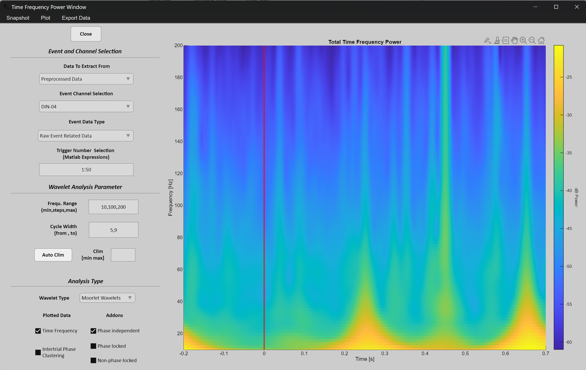
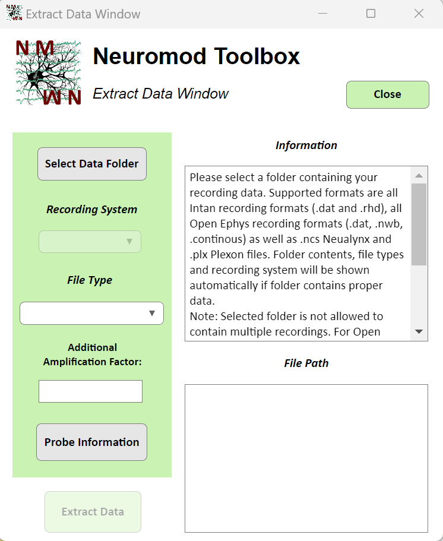

# Neuromod - Fully Interactive Ephys Data Analysis <br> and Visualization for Matlab 
  
Neuromod is an interactive toolbox for analyzing and visualizing electrophysiological data from linear probe recordings. 
It seamlessly integrates established methods and toolboxes, such as Kilosort and Fieldtrip, to offer a wide range of analyses and support for various data formats, all with prooven methods and without reinventing the wheel. 
The aim is to offer a comfortable and user-friendly experience with support for many of the most popular recording formats, while providing clear instructions and feedback on actions taken, rather than hard-to-interpret error messages or opaque processes that leave users uncertain about what was done to their data.

> ## **Table of Contents**
> 
- [Data Formats and Capabilities](#data-formats-and-capabilities)
  
- [How to use the GUI](#how-to-use-the-gui)
  
  - [Overview of Required MATLAB Toolboxes](#overview-of-required-matlab-toolboxes)

  - [Get Started With Example Data](#overview-of-required-matlab-toolboxes)
    
  - [Overview of Other Toolboxes Used](#overview-of-other-toolboxes-used)
 
  - [General Remarks](#general-remarks)
    
  - [Autorun Functionality](#autorun-functionality) 
    
- [Rules and Philosophy of the Toolbox](#rules-and-philosophy-of-the-toolbox)
  
- [Disclaimer, License and Contact](#disclaimer-license-and-contact)

> ## **Data Formats and Capabilities**

<div align="center">
  
</div>

<br>

The toolbox currently supports recordings from linear probes across all Intan systems formats (.dat and .rhd), all Open Ephys formats (.dat, .nwb, .continuous), as well as Spike2 (.smrx), Neuralynx (.ncs), and Plexon (.plx) files.
In addition to raw data, the GUI also supports event data (e.g., TTL signals to the recording system), enabling not only the preprocessing, analysis, and visualization of continuous data but also event-related data using a variety of methods.

Available types of analysis include current source density analysis, static power spectrum analysis, time-frequency power analysis, and event-related potentials for low-frequency signal components.
Additionally, the toolbox fully supports Kilosort 3 and 4, allowing users to save data, create channel maps, and load Kilosort result files for interactive spike data visualization within the GUI.
If Kilosort can’t be used, the toolbox also offers spike detection using different thresholding methods. 

__NOTE:__ Currently only Kilosort 3 and Kilosort 4 versions up to 4.0.8 are supported due to a bug in which the 'spike_positions.npy' Kilosort output file apparently doesnt contain the expected header. When you already install a newer version, install legacy version by typing in your anaconda promt: 
```python
conda activate kilosort
```
```python
python -m pip install "kilosort[gui]"==4.0.8
```

For a guide how to installed Kilosort 4 and for more information visit:

https://github.com/MouseLand/Kilosort

To download Kilsort 3 visit: 

https://github.com/MouseLand/Kilosort/releases/tag/v3.0.2

Nearly all parameters related to data extraction and analysis are automatically set, but can still be adjusted within the GUI.
This design ensures a smooth, code-free user experience, offering helpful guidance while still having full control over the analysis.
Besides the analysis of a single recording with the user interface, an autorun functionality can be used, desgined to apply selected methods to all recordings in a folder, automatically saving all possible analysis visualizations based on a single Config file with a few options to specify (see below).
As a result, Neuromod is not only ideal for teaching and evaluating recording quality before or after sessions but also for comprehensive data analysis of one or multiple recordings. 

Another feature of this user intrerface is the ability to easily add your own data analysis to integrate it into the rest of your analyiss pipeline. 
All you have to do is to follow this link and watch a short tuorial how to create your own app window and integrate it into the rest of the GUI, giving fully real time control over all data components:
LINK TO YOUTUBE TUTORIAL

<table>
  <tr>
    <td></td>
    <td></td>
  </tr>
</table>

> ## **How to use the GUI** ##

- Download and unpack the toolbox files, then run them using a verified and installed version of MATLAB. You have several options to launch the GUI:
  1. Double-click the 'Neuromod_Toolbox_GUI.mlapp' file, which will automatically open MATLAB and the GUI.
  2. Alternatively, use the MATLAB command window to navigate (cd) to the folder where you saved the files. Then, right-click the Neuromod_Toolbox_GUI.mlapp file in the current folder window and select "Run."
  3. Finally, you can also launch the GUI by typing the following command into the MATLAB command window after navigating (cd) to the folder containing the GUI:

```matlab
Neuromod_Toolbox_GUI
```

- Along with Matlab you need the following Matlab Toolboxes for unrestricted functionality:
**Note:**
Some of those Matlab toolboxes are required for fieldtrip, the open ephys analysis tool or some other Github repositories used and are therefore not necessary in every circumstance.
Additionally, only portions of the respective tools and repositories are used, which might make some Matlab toolboxes unnecessary. 

> ### **Overview of required Matlab toolboxes**

**1. To extract Neuralynx or Plexon data, you need:**
```matlab
Database Toolbox
Fixed Point Designer
Image Processing Toolbox
Optimization Toolbox
Robust Control Toolbox
Signal Processing Toolbox
Statistics and Machine Learning Toolbox
Symbolic Math Toolbox
```
**2. For preprocessing (filtering) of data with fieldtrip:**
```matlab
Signal Processing Toolbox
Statistics and Machine Learning Toolbox
```
**3. Spike Repository and with it a lot of spike analyses:**
```matlab
Communications Toolbox
Deep Learning Toolbox
Optimization Toolbox
Signal Processing Toolbox
Statistics and Machine Learning Toolbox
```
**4. For everything else:**
```matlab
Signal Processing Toolbox
Statistics and Machine Learning Toolbox
```

For more information how to install Matlab toolboxes:

https://de.mathworks.com/help/matlab/matlab_env/get-add-ons.html

If you want to extract .smrx files from Spike2, you need to install the Spike2 MATLAB SON Interface from:

https://ced.co.uk/upgrades/spike2matson

When you extract .smrx for the first time, you are asked to select the folder in which you installed the Spike2 MATLAB SON Interface to be able to use the library. The path is saved permanently, so you only have to do this once.

> ### **Get Started With Example Data**


 


In order to get started after opening the user interface for the first time, you can load an example dataset to explore all functionalities this toolbox provides. It is ideal to follow along the youtube tutorial. All functionalities can be accessed in the module overview on the right side of the toolbox. Just select an option and click in the "RUN" button. The first thing you have to do is to either extract data from a recording or to load data you previously saved with the toolbox. To extract data from any dataset in one of the supported data formats select the "Load Raw Recordings" option and click on the "RUN" button on the left side in the "Manage Dataset" module. Following along the descriptions in the window that opens, press the "Select Data Folder" button and select a file with ONLY ONE! recording. Example data can be found in the corresponding folder of this Toolbox. When the recording format of the file(s) in the folder fits, you will see them in the Window. Press the "Probe Information" button to specify the chann spacing and optionally change the order of your recording channel. Click on Proceed and "Extract Data". After being succesfully, you will see your data traces in the main window. 

    
> ### **Overview of Other Toolboxes Used**

Some aspects of data extraction and analysis are handled by other Toolboxes, which dont have to be installed since the required functions are included in the source code (Data Path\Modules\Toolboxes).

Specifically, the data and event extraction of Neuralynx and Plexon file formats (.ncs, .nve and .plx) are handled completely by Fieldtrip using the 'ft_read_data.m' and 'ft_read_header.m' functions. Moreover, Fieldtrip is used to for filtering data in the preprocessing window. Involved functions remained unchanged, there are just costum functions to coordinate them. 

Check out **Fieldtrip**: 

https://github.com/fieldtrip/fieldtrip

Data and event extraction of Open Ephys data formats is handled by the Open Ephys Matlab Tools. As a template, the 'load_all_formats.m' function was used and completly modified. The remaining funcions are unchanged. It is also used as the source for the read_npy.m function. 

Check out the **Open Ephys Matlab Tools**: 

https://github.com/open-ephys/open-ephys-matlab-tools/tree/main

Lastly, some functions from the cortex-lab Github page were used ('Spikes' repository) for spike analysis and LFP Band power analysis. Almost all functions used were modified to make to fit the purpose of this GUI.

Check out the **Spikes repository from the Cortex-Lab**: 

https://github.com/cortex-lab/spikes

- Under GUI_Path\Modules\MISC\LICENSES you can find the LICENSE and Citation files for those toolboxes.

> ### **General Remarks**

If you want to update fieldtrip or one of the other tools available on Github, there are several things to consider:
- First some files of those tools are modified to fit the purpose of this GUI. You cant simply replace them. They are saved in GUI_Path\Modules\Toolboxes\5. Modified\ . When you just update the not modified files, there is no guarantue that they will be compatible with the modified files.
- Second, some tools saved in the folders of this GUI like fieldtrip do not contain all files. This has to do with compatitbility errors with other tools, specifcally the open ephys tools. For some reason I dont know, the open ephys tool wont work with all fieldtrip files in the GUI directory.
- If you encounter errors or things I missed, have questions or want to incorpaorate one of the tools more in depth, please dont hesitate to contact me.
  
> ### **Autorun Functionality**

- If you have multiple recordings and want to apply a fixed analysis pipeline using the GUI, you can automate the process with the Autorun function. This feature eliminates the need to manually navigate the GUI for each recording. Instead, it automatically processes each recording, applying all the data extraction, processing, and analysis steps offered by the GUI while being independent from it. All visualizations and analysis specified are then saved automatically in the respective recording folder.
- You can modify the specific processing steps and parameters using the configuration file located in GUI_Path\Autorun_Configs\Config_Files(do not edit!). However, there’s no need to navigate to this directory or make manual changes, as everything is managed through the Autorun Manager Window. You can access this window from the menu in the top left corner of the GUI’s main window. Simply start the GUI and open the Autorun Manager—no additional steps are required.
- In the Autorun Manager, you can select a configuration file to open directly within the GUI or in MATLAB for editing. To help you get started, a template configuration file is available for each recording system.
- Once you are satisfied with the configuration file, select a folder containing your recording(s), specify your probe properties (channel spacing and optionally channel order) and start the pipeline. The pipeline will run through and give messages about the progress in the matlab command window.
- For more information, see the documentation:
  
[NeuroMod Toolbox Manual](NeuroMod_Toolbox_Manual.docx)

- Or see the README file in each folder containing functions, summarizing all function headers.
  
> ## **Rules and Philosophy of the Toolbox**
> 
- First off: this toolbox is not trying the reinvent the wheel. Rather it takes already established and proven analysis solutions like Kilosort and integrates them into a central hub aiming to bring LFP and spike analysis as well as signal quality measures together in a way, that everyone with (almost) every recording type can use it. 
- All relevant analysis and data parts are saved in a single structure with a limited and clear amount of fields that every window shares. Changes in one window are automatically available in another window.
- All interactive parts like buttons, checkboxes and so on that are disabled (grey and cant be clicked on) can be activated by conducting the necessary analysis step before. For example, to enable to ‘Event Data’ checkbox on the right of the main window, you first have to extract events. 
- If the user tries to do an analysis without proper preprocessing or enters a wrong format into any field requiring user input, values are either autocorrected and/or the user gets a message why the operation is not possible. The aim is to give an explanation of what to do when an error occurs, not only throw out an error nobody understands. 
- In every window were you select a folder to load and some information about folder or data contents are shown, the folders were autosearched for the expected contents. If no expected contents were found, the user gets a message that nothing was found and has to select himself. This means that when you see information there, everything goes well. 
- All functions are designed in a way that they can be easily used outside of the user interface with just a few support functions, including all visualizations. This enables the Autorun functionality of the GUI, where you can apply all analysis and plots in a loop to several recordings.

> ## **Disclaimer, License and Contact**
This toolbox was created and is maintained by a single person as part of a PhD Project and Hobby. There is no guarantee for any of the analysis and results but dedication to fix bugs and evolve this.
Feel free to contact me for tips and requests or pull a request/open an issue on Github. I try to get around all of them and provide guidance and help. 
